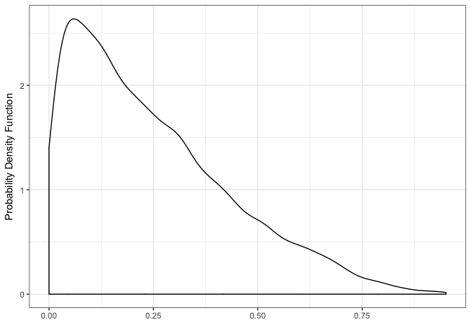

<!-- README.md is generated from README.Rmd. Please edit that file -->
NewPackage
==========

The goal of NewPackage is to ...

Example
-------

This is a basic example which shows you how to solve a common problem:

``` r
library(NewPackage)
beta_plot(a = 1,b = 3)
```


